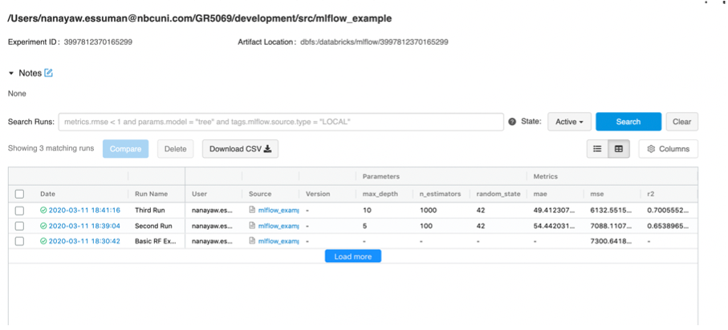
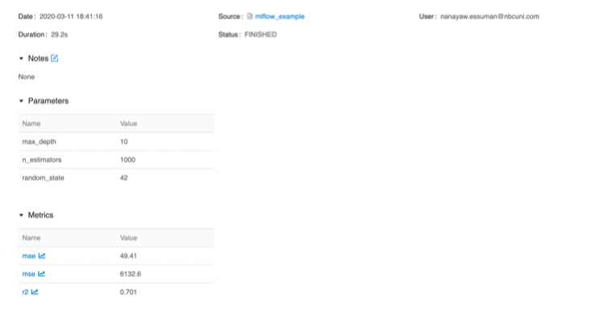
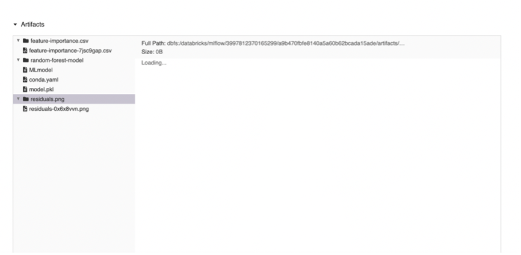

# Homework #4: model building and tracking

**Instructions**: For this assignment, we’d like you to use the F1 Datasets we have been using for the class to build any ML model of your choice and track the model for each run using [**MLflow**](https://www.mlflow.org). Select any of the F1 datasets in AWS S3 to build your model. You are allowed to join multiple datasets.

1. [`20 pts`] Build any model of your choice with tunable hyperparameters
2. [`20 pts`] Create an experiment setup where - for each run - you log:
	* the hyperparameters used in the model
	* the model itself
	* every possible metric from the model you chose
	* at least two artifacts (plots, or csv files)
3. [`20 pts`] Track your MLFlow experiment and run at least 10 experiments with different parameters each
4. [`20 pts`] Select your best model run and explain why
5. [`20 pts`] As part of your GitHub classroom submission include screenshots of
	* your MLFlow Homepage

	

	* your detailed run page

	

	
